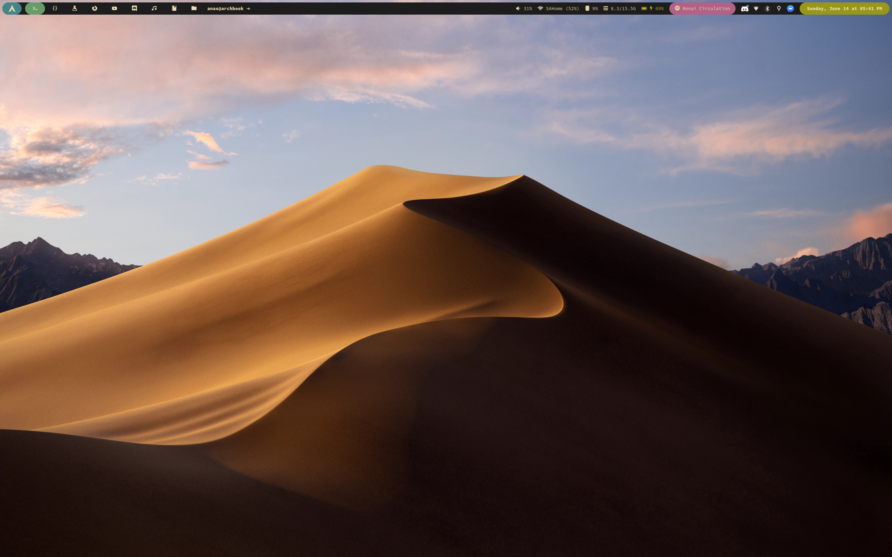
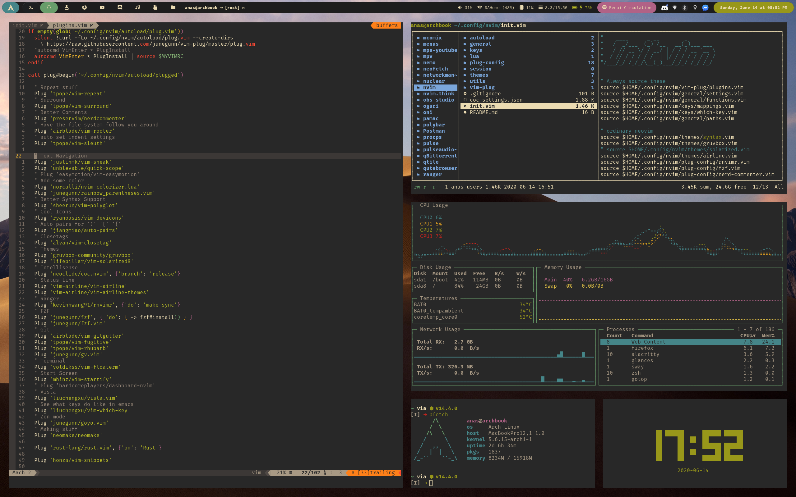

_nvim, ranger, gotop, pfetch, tty-clock_

## Dotfiles

My arch linux dotfiles

- **Operating System:** Arch Linux
- **Shell:** zsh + zplug
- **DM:** ly
- **WM:** Sway + Waybar
- **Editor:** Neovim
- **Terminal:** Alacritty
- **Browser:** Firefox

_Works on my machine_ ¯\\\_(ツ)\_/¯
